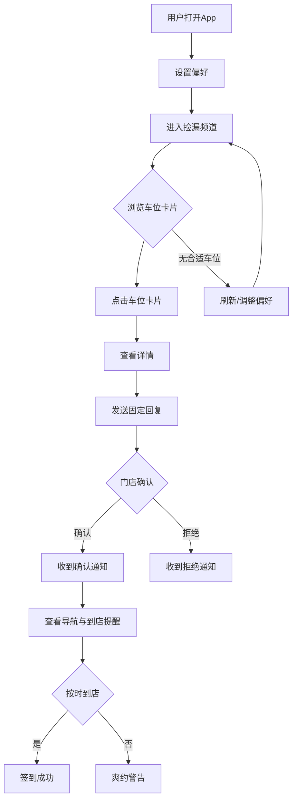

## 1. 产品概述

临车捡漏频道是一款面向同城剧本杀玩家的移动端快捷拼车应用，核心场景是让空闲玩家在极短时间内找到即将开场、仍缺人的剧本车位。与传统预约制约本平台不同，本产品聚焦"两小时内即将开本、缺人等补位"的实时捡漏需求，帮助下班后临时想玩、学生晚课结束想捡便宜车位、老玩家想补位救车的用户，以最快速度匹配到合适车位。

## 2. 核心功能

### 2.1 用户角色

| 角色 | 注册方式 | 核心权限 |
|------|----------|----------|
| 玩家 | 手机号注册 | 设置偏好、浏览车位、发送固定回复、查看导航与提醒 |
| 门店 | 手机号注册+资质认证 | 发布车位、确认玩家、管理开场信息 |

### 2.2 功能模块

1. **偏好设置页**：选择商圈、出发距离、剧本类型、可玩时长、是否接受反串
2. **捡漏频道页**：两小时内即将开场且缺人的车位列表，实时倒计时
3. **车位详情页**：完整车位信息、固定回复按钮、门店确认状态
4. **我的行程页**：已确认车位、导航入口、到店倒计时、爽约提示
5. **门店发布页**：门店发布/编辑车位信息、管理确认玩家

### 2.3 页面详情

| 页面名称 | 模块名称 | 功能描述 |
|----------|----------|----------|
| 偏好设置页 | 商圈选择 | 基于定位展示附近商圈列表，支持多选 |
| 偏好设置页 | 出发距离 | 滑块选择可接受距离范围（1-20km） |
| 偏好设置页 | 剧本类型 | 标签多选：欢乐、恐怖、情感、硬核、阵营、机制、还原、其他 |
| 偏好设置页 | 可玩时长 | 选择时长区间：3h以内、3-5h、5-7h、7h+ |
| 偏好设置页 | 反串偏好 | 开关：是否接受反串角色 |
| 捡漏频道页 | 倒计时头图 | 距最近开本的倒计时，营造紧迫感 |
| 捡漏频道页 | 筛选栏 | 快速切换类型标签，刷新按钮 |
| 捡漏频道页 | 车位卡片 | 店名、剧本名、缺口人数、当前阵容、价格优惠、DM新手友好、最晚锁车时间 |
| 捡漏频道页 | 紧急标识 | 30分钟内即将锁车的卡片高亮闪烁 |
| 车位详情页 | 剧本信息 | 剧本类型、人数配置、时长、难度 |
| 车位详情页 | 当前阵容 | 已确认玩家头像及角色分配 |
| 车位详情页 | 固定回复 | "我能到"、"需要十分钟确认"、"只接XX本"等快捷回复按钮 |
| 车位详情页 | 锁车倒计时 | 最晚锁车时间实时倒计时 |
| 车位详情页 | 价格信息 | 原价、捡漏价、节省金额 |
| 我的行程页 | 行程卡片 | 已确认车位信息、到店倒计时 |
| 我的行程页 | 导航入口 | 一键跳转地图导航 |
| 我的行程页 | 爽约提示 | 到店时间不足时弹窗提醒，爽约记录展示 |
| 门店发布页 | 车位发布 | 填写剧本、人数、时间、价格、DM信息 |
| 门店发布页 | 确认管理 | 查看玩家回复、确认或拒绝 |

## 3. 核心流程

**玩家捡漏流程**：用户打开App → 设置偏好（商圈/距离/类型/时长/反串） → 进入捡漏频道浏览两小时内缺人车位 → 点击感兴趣的车位卡片 → 查看详情 → 发送固定回复（我能到/需要十分钟确认/只接XX本） → 门店确认 → 收到确认通知 → 查看导航与到店提醒 → 按时到店或收到爽约警告

**门店发布流程**：门店登录 → 发布车位信息（剧本/人数/时间/价格/DM） → 等待玩家回复 → 确认玩家 → 车位满员或锁车时间到达 → 开本

## 4. 用户界面设计

### 4.1 设计风格

- **主色调**：深色系底色（深夜紫黑 #0D0B1A）搭配霓虹橙（#FF6B35）和电光绿（#00FF88）作为强调色，营造都市夜生活的紧迫感和刺激感
- **次色调**：卡片使用半透明毛玻璃效果（rgba深紫+blur），文字以白色和浅紫为主
- **按钮风格**：圆角胶囊按钮，主操作霓虹橙填充带微光动画，次要操作描边样式
- **字体**：数字使用等宽字体突出倒计时紧迫感，正文使用系统圆体，标题使用粗体无衬线
- **布局风格**：移动端全屏卡片流，底部固定操作栏，顶部吸顶筛选
- **图标风格**：线性描边图标，霓虹橙色调，配合微动效
- **氛围元素**：背景有细微粒子/光斑动画模拟城市灯光，卡片hover有霓虹边框渐显效果

### 4.2 页面设计概览

| 页面名称 | 模块名称 | UI 元素 |
|----------|----------|---------|
| 偏好设置页 | 商圈选择 | 芯片标签多选，选中态霓虹橙填充+白字 |
| 偏好设置页 | 出发距离 | 自定义滑块，轨道渐变色，气泡显示km数 |
| 偏好设置页 | 剧本类型 | 横向滚动标签组，每个类型带小图标 |
| 偏好设置页 | 可玩时长 | 时间段按钮组，选中态发光边框 |
| 偏好设置页 | 反串开关 | 霓虹风格开关，开态电光绿 |
| 捡漏频道页 | 倒计时头图 | 大号等宽数字，毫秒级跳动，背景脉冲波纹 |
| 捡漏频道页 | 筛选栏 | 横向滚动胶囊标签+刷新按钮带旋转动画 |
| 捡漏频道页 | 车位卡片 | 毛玻璃卡片，左上缺口人数角标，底部锁车倒计时条，紧急卡片橙光呼吸动画 |
| 车位详情页 | 剧本信息 | 顶部剧本封面区域+类型标签云 |
| 车位详情页 | 当前阵容 | 头像圆形排列，空位虚线圆+闪烁 |
| 车位详情页 | 固定回复 | 底部固定操作栏，胶囊按钮横向排列 |
| 车位详情页 | 锁车倒计时 | 圆形进度环+数字，颜色从绿到橙到红渐变 |
| 我的行程页 | 行程卡片 | 卡片左侧状态色条（绿=进行中、橙=即将到店、红=超时警告） |
| 我的行程页 | 导航按钮 | 霓虹橙胶囊按钮+箭头图标 |
| 门店发布页 | 发布表单 | 深色输入框+霓虹聚焦边框，下拉选择器 |

### 4.3 响应式设计

- **移动优先**：全页面以375px宽度为基准设计，最大宽度428px居中
- **触控优化**：所有可点击区域最小44px触控目标，按钮间距8px以上
- **滑动手势**：车位卡片支持左滑快捷回复，详情页支持下拉关闭
- **横屏适配**：横屏时切换为双列卡片布局

### 4.4 3D 场景指引

不适用
