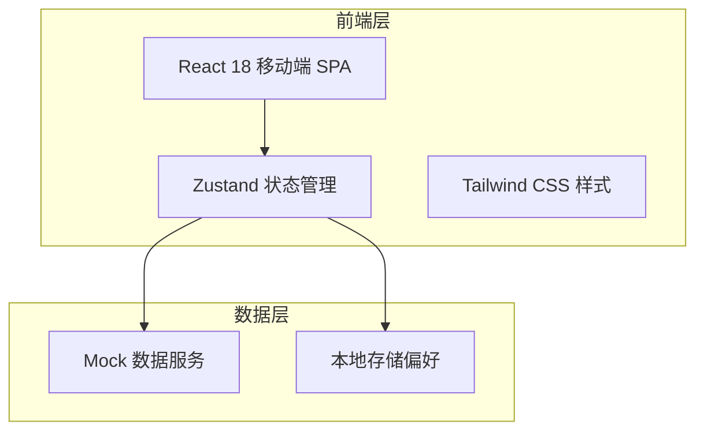
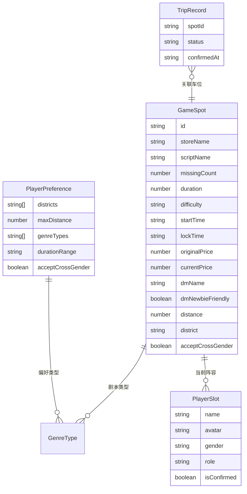

## 1. 架构设计



## 2. 技术说明

- **前端**：React@18 + Tailwind CSS@3 + Vite
- **初始化工具**：vite-init（react-ts 模板）
- **后端**：无（纯前端 Mock 数据演示）
- **数据库**：无（使用内存 Mock 数据 + localStorage 持久化用户偏好）
- **状态管理**：Zustand
- **路由**：react-router-dom v6
- **图标**：lucide-react

## 3. 路由定义

| 路由 | 用途 |
|------|------|
| / | 偏好设置页（首次使用）/ 捡漏频道页（已有偏好） |
| /channel | 捡漏频道页 - 展示两小时内缺人车位列表 |
| /setup | 偏好设置页 - 设置商圈、距离、类型等偏好 |
| /spot/:id | 车位详情页 - 查看车位完整信息并发送回复 |
| /trips | 我的行程页 - 已确认车位和导航 |
| /publish | 门店发布页 - 发布新车位 |

## 4. API 定义

本项目为纯前端演示，使用 Mock 数据。定义以下数据接口：

```typescript
interface PlayerPreference {
  districts: string[]
  maxDistance: number
  genreTypes: GenreType[]
  durationRange: DurationRange
  acceptCrossGender: boolean
}

interface GameSpot {
  id: string
  storeName: string
  storeAvatar: string
  scriptName: string
  scriptCover: string
  genreTypes: GenreType[]
  playerCount: { min: number; max: number }
  currentPlayers: PlayerSlot[]
  missingCount: number
  duration: number
  difficulty: 'easy' | 'medium' | 'hard'
  startTime: string
  lockTime: string
  originalPrice: number
  currentPrice: number
  dmName: string
  dmNewbieFriendly: boolean
  distance: number
  district: string
  acceptCrossGender: boolean
}

interface PlayerSlot {
  name: string
  avatar: string
  gender: 'male' | 'female'
  role?: string
  isConfirmed: boolean
}

type GenreType = '欢乐' | '恐怖' | '情感' | '硬核' | '阵营' | '机制' | '还原' | '其他'
type DurationRange = '3h以内' | '3-5h' | '5-7h' | '7h+'

interface QuickReply {
  id: string
  label: string
  type: 'confirm' | 'pending' | 'conditional'
}

interface TripRecord {
  spotId: string
  status: 'confirmed' | 'pending' | 'completed' | 'noshow'
  confirmedAt: string
  arrivedAt?: string
}
```

## 5. 服务端架构图

不适用（纯前端项目）

## 6. 数据模型

### 6.1 数据模型定义



### 6.2 数据定义语言

不适用（使用 TypeScript Mock 数据，无数据库）
